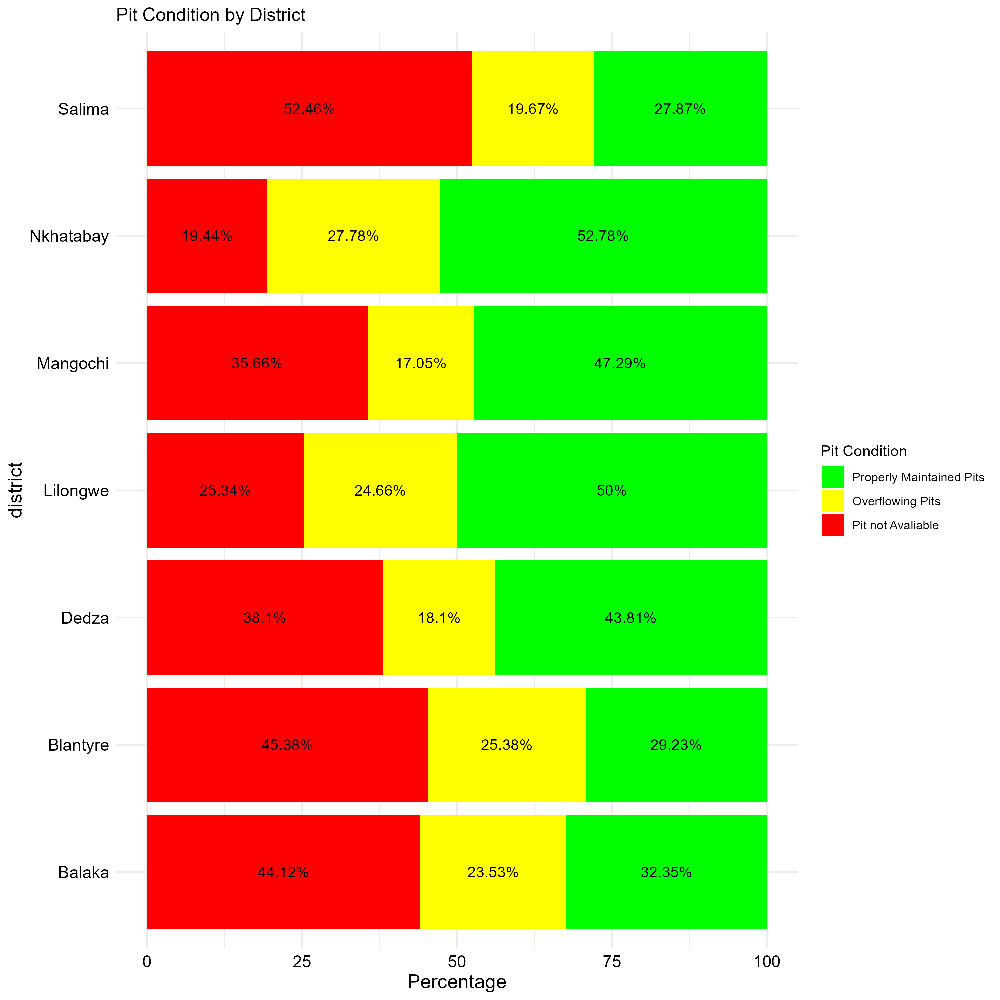

```{r setup, echo=FALSE}
knitr::opts_chunk$set(echo = FALSE)


```

```{r echo=FALSE}


if(!require(pacman)) install.packages("pacman")

p_load(
  tidyverse,
  here,
  summarytools,
  janitor,
  sf, 
  tmap,
  OpenStreetMap,
  flextable,
  rio, 
  gtsummary, 
  epikit, 
  gt
)


conflicted::conflicts_prefer(dplyr::filter)
conflicted::conflicts_prefer(flextable::align)


```

# loading data

```{r echo=FALSE, }

# importing the data 
cholera_data<- import( here("data/cholera_data_.csv")) %>%
                clean_names() %>% 
  mutate(district=recode(
      district, 
      "Blantyre_City"="Blantyre"
    ))%>% 
   mutate(residence = case_when(
district %in% c("Lilongwe", "Blantyre", "Dedza", "Bakala") ~ "In land",
    TRUE ~ "lake shore" )) 

# changing the data.frame into tibble object for easy handling 
cholera_data<- tibble(cholera_data)


# filtering out those less than 18 years 
cholera_data<-cholera_data %>% 
  filter(age_group!="<18")

ta_shapefile<-st_read(
  here("data/MWI_adm1.shp")
) %>% 
  select(
   NAME_1,
    ID_0,
    ID_1) %>% 
  dplyr::rename(
    "District"= NAME_1
  )


```

# Social and behavioral factors that influence current water treatment.

## Houshold awareness of the Health Risk Associated with drinking untreated Water by Sex, Age-Group, Level of Education, and Ethnicity

```{r echo=FALSE}

awareness_of_heathRisk<-cholera_data %>% 
                 select(
                   sex, 
                   age_group, 
                   level_education, 
                   ethnicity,
health_risk_associated_with_drinking_untreated_water
                 )


awareness_of_heathRisk<- awareness_of_heathRisk %>% 
            tbl_summary(health_risk_associated_with_drinking_untreated_water,
            percent = "row",
            digits = list(
              sex ~ c(0, 1),
              age_group ~ c(0, 1),
              level_education ~ c(0, 1), 
              ethnicity ~ c(0, 1)
            ))


awareness_of_heathRisk |> 
   modify_caption("**Awareness of Health Risk Associated with Drinking Untreated Water**")


```

## Houshold awareness of the Health Risk Associated with drinking untreated Water by District and Residence

```{r echo=FALSE}

aware_by_dist_res<-cholera_data %>% 
                 select(
                   district,
                   residence,
health_risk_associated_with_drinking_untreated_water
                 )


aware_by_dist_res %>% 
          
  tbl_summary(health_risk_associated_with_drinking_untreated_water,
            percent = "row",
            digits = list(
             district ~ c(0, 1),
             residence ~ c(0, 1)
            )) |> 

  modify_caption("**Awareness of Health Risk Associated with Drinking Untreated Water by District and Residence**")

```

### 2.3. 0 Main sources of drinking water during the dry season by District and Residence

```{r echo=FALSE}
drinking_dry<-cholera_data %>% 
  select(district, 
         residence, 
         main_source_of_drinking_water_dry_season)


drinking_dry<- drinking_dry %>% 
  group_by( district, 
            main_source_of_drinking_water_dry_season) %>%
  count(main_source_of_drinking_water_dry_season) %>%
    pivot_wider(
    names_from = main_source_of_drinking_water_dry_season, 
    values_from = n
  )

# replacing NA with Zero 
drinking_dry[is.na(drinking_dry)]<-0


main_source_table<- drinking_dry %>% 
  rowwise() %>% 
  mutate(total= sum(across(where(is.numeric))), 
         
         percentage=round(community_standpipe/total*100, 2),
          community_standpipe=paste0(community_standpipe,
                                   " (", round(percentage, 1), "%)"),
        percentage=round(borehole_1/total*100, 2 ),
        borehole_1=paste0(borehole_1, " (", round(percentage, 1), "%)"),
             percentage= round(piped_into_dwelling/total*100, 2),
                 piped_into_dwelling=paste0(piped_into_dwelling,
                                   " (", round(percentage, 1), "%)"),
             percentage= round(piped_into_yard_plot/total*100, 2),
                 piped_into_yard_plot=paste0(piped_into_yard_plot,
                                   " (", round(percentage, 1), "%)"),
                 percentage=round(protected_well_1/total*100, 2), 
           protected_well_1=paste0(protected_well_1,
                                   " (", round(percentage, 1), "%)"),
                 percentage=round(unprotected_well_1/total*100, 2),
           unprotected_well_1=paste0(unprotected_well_1,
                                   " (", round(percentage, 1), "%)"),
                   percentage=round(other_drinking_source/total*100, 2),
              other_drinking_source=paste0(other_drinking_source,
                                   " (", round(percentage, 1), "%)"),
         percentage=round(river_stream/total*100, 2), 
              river_stream=paste0(river_stream,
                                   " (", round(percentage, 1), "%)"),
         percentage=round(spring_1/total*100, 2), 
       spring_1=paste0(spring_1, " (", round(percentage, 1), "%)"),
         percentage=round(dam/total/100, 2), 
      dam=paste0(dam, " (", round(percentage, 1), "%)"),
         percentage=round(bottled_water/total*100, 2), 
   bottled_water=paste0(bottled_water, " (", round(percentage, 1), "%)"),
         percentage=round(tanker_truck_bower/total*100, 2), 
tanker_truck_bower=paste0(tanker_truck_bower,
                          " (", round(percentage, 1), "%)"),
         percentage=round(lake/total*100, 2),
    lake=paste0(lake, " (", round(percentage, 1), "%)")
         )

main_source_table<- main_source_table %>% 
  rename_with(~ str_replace_all(., "_", " ")) %>% 
    rename_with(~ str_replace_all(., "1", "")) %>% 
  select(-total, -percentage) %>%
    as_flextable() %>% 
 flextable::rotate(j = c(2:14), part = "header",
         rotation = "btlr") %>%  # Rotate header text 90°
flextable:: align(align = "center", part = "header") %>% 
  autofit() %>%  # Fit column content first
 flextable:: width(j = NULL, width = 1.2)


drinking_dry_redience<-cholera_data %>% 
  select(residence, 
         main_source_of_drinking_water_dry_season)

drinking_dry_redience<- drinking_dry_redience%>% 
  group_by( residence,
           main_source_of_drinking_water_dry_season) %>%
  count(main_source_of_drinking_water_dry_season) %>%
    pivot_wider(
    names_from = main_source_of_drinking_water_dry_season, 
    values_from = n
  )


# replacing NA with Zero 
drinking_dry_redience[is.na(drinking_dry_redience)]<-0


    table5<- drinking_dry_redience %>% 
      rowwise() %>% 
  mutate(total= sum(across(where(is.numeric))), 
         
      percentage=round(community_standpipe/total*100, 2),
          community_standpipe=paste0(community_standpipe,
                                   " (", round(percentage, 1), "%)"),
        percentage=round(borehole_1/total*100, 2 ),
        borehole_1=paste0(borehole_1, " (", round(percentage, 1), "%)"),
             percentage= round(piped_into_dwelling/total*100, 2),
                 piped_into_dwelling=paste0(piped_into_dwelling,
                                   " (", round(percentage, 1), "%)"),
             percentage= round(piped_into_yard_plot/total*100, 2),
                 piped_into_yard_plot=paste0(piped_into_yard_plot,
                                   " (", round(percentage, 1), "%)"),
                 percentage=round(protected_well_1/total*100, 2), 
           protected_well_1=paste0(protected_well_1,
                                   " (", round(percentage, 1), "%)"),
                 percentage=round(unprotected_well_1/total*100, 2),
           unprotected_well_1=paste0(unprotected_well_1,
                                   " (", round(percentage, 1), "%)"),
                   percentage=round(other_drinking_source/total*100, 2),
              other_drinking_source=paste0(other_drinking_source,
                                   " (", round(percentage, 1), "%)"),
         percentage=round(river_stream/total*100, 2), 
              river_stream=paste0(river_stream,
                                   " (", round(percentage, 1), "%)"),
         percentage=round(spring_1/total*100, 2), 
       spring_1=paste0(spring_1, " (", round(percentage, 1), "%)"),
         percentage=round(dam/total/100, 2), 
      dam=paste0(dam, " (", round(percentage, 1), "%)"),
         percentage=round(bottled_water/total*100, 2), 
   bottled_water=paste0(bottled_water, " (", round(percentage, 1), "%)"),
         percentage=round(tanker_truck_bower/total*100, 2), 
tanker_truck_bower=paste0(tanker_truck_bower,
                          " (", round(percentage, 1), "%)"),
         percentage=round(lake/total*100, 2),
    lake=paste0(lake, " (", round(percentage, 1), "%)")
         )
         
         
table5<- table5%>% 
  rename_with(~ str_replace_all(., "_", " ")) %>% 
    rename_with(~ str_replace_all(., "1", "")) %>% 
  select(-total, -percentage) %>%
    as_flextable() %>% 
 flextable::rotate(j = c(2:14), part = "header",
         rotation = "btlr") %>%  # Rotate header text 90°
flextable:: align(align = "center", part = "header") %>% 
  autofit() %>%  # Fit column content first
 flextable:: width(j = NULL, width = 1.2)
    


main_source_table
table5


%>% set_table_properties(layout = "autofit", width = .75)```

## 2.4. 0 Main sources of drinking water during the wet season by District

```{r echo=FALSE}

wet_drink_district <- cholera_data %>% 
                      select(district, 
                             main_source_of_drinking_water_wet_season)


wet_drink_district<- wet_drink_district %>% 
  group_by( district, 
           main_source_of_drinking_water_wet_season) %>%
  count(main_source_of_drinking_water_wet_season) %>%
    pivot_wider(
    names_from = main_source_of_drinking_water_wet_season, 
    values_from = n
  )


# replacing NA with Zero 
wet_drink_district[is.na(wet_drink_district)]<-0


table6<- wet_drink_district %>% 
  rowwise() %>% 
  mutate(total= sum(across(where(is.numeric))), 
         
          percentage=round(community_standpipe/total*100, 2),
          community_standpipe=paste0(community_standpipe,
                                   " (", round(percentage, 1), "%)"),
        percentage=round(borehole_1/total*100, 2 ),
        borehole_1=paste0(borehole_1, " (", round(percentage, 1), "%)"),
             percentage= round(piped_into_dwelling/total*100, 2),
                 piped_into_dwelling=paste0(piped_into_dwelling,
                                   " (", round(percentage, 1), "%)"),
             percentage= round(piped_into_yard_plot/total*100, 2),
                 piped_into_yard_plot=paste0(piped_into_yard_plot,
                                   " (", round(percentage, 1), "%)"),
                 percentage=round(protected_well_1/total*100, 2), 
           protected_well_1=paste0(protected_well_1,
                                   " (", round(percentage, 1), "%)"),
                 percentage=round(unprotected_well_1/total*100, 2),
           unprotected_well_1=paste0(unprotected_well_1,
                                   " (", round(percentage, 1), "%)"),
                   percentage=round(other_drinking_source/total*100, 2),
              other_drinking_source=paste0(other_drinking_source,
                                   " (", round(percentage, 1), "%)"),
         percentage=round(river_stream/total*100, 2), 
              river_stream=paste0(river_stream,
                                   " (", round(percentage, 1), "%)"),
         percentage=round(spring_1/total*100, 2), 
       spring_1=paste0(spring_1, " (", round(percentage, 1), "%)"),
         percentage=round(dam/total/100, 2), 
      dam=paste0(dam, " (", round(percentage, 1), "%)"),
         percentage=round(bottled_water/total*100, 2), 
   bottled_water=paste0(bottled_water, " (", round(percentage, 1), "%)"),
         percentage=round(tanker_truck_bower/total*100, 2), 
tanker_truck_bower=paste0(tanker_truck_bower,
                          " (", round(percentage, 1), "%)"),
         percentage=round(lake/total*100, 2),
    lake=paste0(lake, " (", round(percentage, 1), "%)")
         )
         


 table6 %>% 
rename_with(~ str_replace_all(., "_", " ")) %>% 
    rename_with(~ str_replace_all(., "1", "")) %>% 
  select(-total, -percentage) %>%
    as_flextable() %>% 
 flextable::rotate(j = c(2:15), part = "header",
         rotation = "btlr") %>%  # Rotate header text 90°
flextable:: align(align = "center", part = "header") %>% 
  autofit() %>%  # Fit column content first
 flextable:: width(j = NULL, width = 1.2)


# by Zone 


wet_drink_zone <- cholera_data %>% 
                      select(residence, 
                             main_source_of_drinking_water_wet_season)


wet_drink_zone<- wet_drink_zone %>% 
  group_by( residence,, 
           main_source_of_drinking_water_wet_season) %>%
  count(main_source_of_drinking_water_wet_season) %>%
    pivot_wider(
    names_from = main_source_of_drinking_water_wet_season, 
    values_from = n
  )


# replacing NA with Zero 
wet_drink_zone[is.na(wet_drink_zone)]<-0


table7<- wet_drink_zone%>% 
  rowwise() %>% 
  mutate(total= sum(across(where(is.numeric))), 
         
             percentage=round(community_standpipe/total*100, 2),
          community_standpipe=paste0(community_standpipe,
                                   " (", round(percentage, 1), "%)"),
        percentage=round(borehole_1/total*100, 2 ),
        borehole_1=paste0(borehole_1, " (", round(percentage, 1), "%)"),
             percentage= round(piped_into_dwelling/total*100, 2),
                 piped_into_dwelling=paste0(piped_into_dwelling,
                                   " (", round(percentage, 1), "%)"),
             percentage= round(piped_into_yard_plot/total*100, 2),
                 piped_into_yard_plot=paste0(piped_into_yard_plot,
                                   " (", round(percentage, 1), "%)"),
                 percentage=round(protected_well_1/total*100, 2), 
           protected_well_1=paste0(protected_well_1,
                                   " (", round(percentage, 1), "%)"),
                 percentage=round(unprotected_well_1/total*100, 2),
           unprotected_well_1=paste0(unprotected_well_1,
                                   " (", round(percentage, 1), "%)"),
                   percentage=round(other_drinking_source/total*100, 2),
              other_drinking_source=paste0(other_drinking_source,
                                   " (", round(percentage, 1), "%)"),
         percentage=round(river_stream/total*100, 2), 
              river_stream=paste0(river_stream,
                                   " (", round(percentage, 1), "%)"),
         percentage=round(spring_1/total*100, 2), 
       spring_1=paste0(spring_1, " (", round(percentage, 1), "%)"),
         percentage=round(dam/total/100, 2), 
      dam=paste0(dam, " (", round(percentage, 1), "%)"),
         percentage=round(bottled_water/total*100, 2), 
   bottled_water=paste0(bottled_water, " (", round(percentage, 1), "%)"),
         percentage=round(tanker_truck_bower/total*100, 2), 
tanker_truck_bower=paste0(tanker_truck_bower,
                          " (", round(percentage, 1), "%)"),
         percentage=round(lake/total*100, 2),
    lake=paste0(lake, " (", round(percentage, 1), "%)")
         )
         


table7 %>% 
     rename_with(~ str_replace_all(., "_", " ")) %>% 
    rename_with(~ str_replace_all(., "1", "")) %>% 
  select(-total, -percentage) %>%
    as_flextable() %>% 
 flextable::rotate(j = c(2:15), part = "header",
         rotation = "btlr") %>%  # Rotate header text 90°
flextable:: align(align = "center", part = "header") %>% 
  autofit() %>%  # Fit column content first
 flextable:: width(j = NULL, width = 1.2)
   


%>% set_table_properties(layout = "autofit", width = .75)```

### 2.5.1 Water Treatment at Household by Sex, Level of Education, Religion

```{r echo=FALSE}

Water_treat<-cholera_data %>% 
         select(sex, 
                age_group, 
                level_education, 
                religion, 
                ethnicity,
                treat_drinking_water)


table8<- Water_treat %>% 
  tbl_summary(treat_drinking_water, 
              percent = "row", 
              digits = list(
                sex~ c(0, 2), 
                age_group~c(0,2), 
                level_education~ c(0,2), 
                religion~c(0,2)
              ))

table8 |> 
  modify_caption("**Treament of drinking Water  by demographic variables**")


```

### 2.5.2 Water Treatment at Household by District and Residence

```{r echo=FALSE}
 

Water_treat_district_zone<-cholera_data %>%
         select(district,
                residence,
                treat_drinking_water)


table9<- Water_treat_district_zone%>%
  tbl_summary(treat_drinking_water,
              percent = "row",
              digits = list(
                district~ c(0, 2),
                residence~c(0,2)

              ))

table9 |> 
  modify_caption("**Treament of drinking water  by District and Residence**")

```

### 2.5.1 yes, Methods of water treatment by District

for methods of water treatment, will filter out those who do not treat water. n(496)

```{r echo=FALSE, fig.height=7, fig.width=14}


methods_water <- cholera_data %>% 
              filter(treat_drinking_water=="yes") %>%
               select(
                  sex,
                  age_group,
                  level_education,
                  religion,
                 c(34:41)
               )


age_group_table<-methods_water %>%
  select(
    age_group,
    where(is.numeric)
  ) %>% 
  pivot_longer(
    cols = (2:9)
  ) %>%
  drop_na(value) %>%
  group_by(
     age_group,
      name) %>%
  summarise(value=sum(value)) %>%
  pivot_wider(
    names_from = name,
  values_from = value,
  ) %>%
  group_by(
    age_group
  ) %>%
  rowwise() %>%
  mutate(total=sum(across(where(is.numeric)))) %>% 
   rename("variable"=age_group)


  sex_table<-methods_water %>%
  select(
    sex,
    where(is.numeric)
  ) %>% 
  pivot_longer(
    cols = (2:9)
  ) %>%
  drop_na(value) %>%
  group_by(
     sex,
      name) %>%
  summarise(value=sum(value)) %>%
  pivot_wider(
    names_from = name,
  values_from = value,
  ) %>%
  group_by(
    sex
  ) %>%
  rowwise() %>%
  mutate(total=sum(across(where(is.numeric)))) %>% 
   rename("variable"=sex)
    

    
education_table<- methods_water %>%
  select(
    level_education,
    where(is.numeric)
  ) %>% 
  pivot_longer(
    cols = (2:9)
  ) %>%
  drop_na(value) %>%
  group_by(
     level_education,
      name) %>%
  summarise(value=sum(value)) %>%
  pivot_wider(
    names_from = name,
  values_from = value,
  ) %>%
  group_by(
    level_education,
  ) %>%
  rowwise() %>%
  mutate(total=sum(across(where(is.numeric)))) %>% 
   rename("variable"=level_education)
 
    
    
    
religion_table<-methods_water %>%
  select(
    religion,
    where(is.numeric)
  ) %>% 
  pivot_longer(
    cols = (2:9)
  ) %>%
  drop_na(value) %>%
  group_by(
     religion,
      name) %>%
  summarise(value=sum(value)) %>%
  pivot_wider(
    names_from = name,
  values_from = value,
  ) %>%
  group_by(
    religion,
  ) %>%
  rowwise() %>%
  mutate(total=sum(across(where(is.numeric)))) %>% 
   rename("variable"=religion)

    
    # Combine all tables into one
    table10 <- bind_rows(sex_table,
                         age_group_table,
                         education_table,
                         religion_table)

 table10<- table10 %>%
  mutate(
 percentage= round(method_of_water_treatment_boiling/total*100, 2) ,
 
 method_of_water_treatment_boiling= paste0(method_of_water_treatment_boiling,
          " (", round(percentage, 1), "%)"),
 
 percentage= round(method_of_water_treatment_ceramic_filter/total*100, 2),
 
 method_of_water_treatment_ceramic_filter= paste0(method_of_water_treatment_ceramic_filter,
          " (", round(percentage, 1), "%)"), 
 
 
 percentage= round(method_of_water_treatment_filter_with_cloth/total*100, 2),
 
 
 method_of_water_treatment_filter_with_cloth= paste0(method_of_water_treatment_filter_with_cloth,
          " (", round(percentage, 1), "%)"),
 
percentage=round(method_of_water_treatment_others_methods/total*100, 2),
 
 
 method_of_water_treatment_others_methods= paste0(method_of_water_treatment_others_methods,
          " (", round(percentage, 1), "%)"),
 
 
 percentage=round(method_of_water_treatment_solar_disinfection/total*100, 2),


 method_of_water_treatment_solar_disinfection= paste0(method_of_water_treatment_solar_disinfection,
          " (", round(percentage, 1), "%)"),


percentage=round(method_of_water_treatment_stand_settle/total*100, 2),

 method_of_water_treatment_stand_settle= paste0(method_of_water_treatment_stand_settle,
          " (", round(percentage, 1), "%)"),

 percentage= round(method_of_water_treatment_use_chlorine/total*100, 2),

 method_of_water_treatment_use_chlorine= paste0(method_of_water_treatment_use_chlorine,
          " (", round(percentage, 1), "%)"),


 percentage=round(method_of_water_treatment_use_water_from_tap/total*100, 2),

 method_of_water_treatment_use_water_from_tap= paste0(method_of_water_treatment_use_water_from_tap,
          " (", round(percentage, 1), "%)")

    )
 
 
 
 table10 %>% 
   rename("Characterists"=variable) %>%
   select(-total, -percentage) %>% 
   rename_with(~ str_replace_all(., 
       "method_of_water_treatment_", " ")) %>% 
    rename_with(~ str_replace_all(., "_", " ")) %>% 
    as_flextable() %>% 
 flextable::rotate(j = c(2:9), part = "header",
         rotation = "btlr") %>%  # Rotate header text 90°
flextable:: align(align = "center", part = "header") %>% 
  autofit() %>%  # Fit column content first
 flextable:: width(j = NULL, width = 1.2)

 

%>% set_table_properties(layout = "autofit", width = .75)```

### 2.5.3 Methods of water treatment by District and Residence

for methods of water treatment, will filter out those who do not treat water. n(496)

```{r include=FALSE}

methods_water_district <- cholera_data %>% 
       filter(treat_drinking_water=="yes") %>%
               select(
                 district, 
                 residence,
                 c(34:41)
               )

tabel11_district<- methods_water_district %>% 
  select(
    district,
    where(is.numeric)
  ) %>%
  pivot_longer(
    cols = (2:9)
  ) %>% 
  drop_na(value) %>% 
  group_by(
    district, 
    name) %>% 
  summarise(value=sum(value)) %>% 
  pivot_wider(
    names_from = name, 
  values_from = value, 
  ) %>% 
  group_by(
    district
  ) %>% 
  rowwise() %>% 
  mutate(total=sum(across(where(is.numeric)))) %>% 
  rename("variable"=district)


table11_residence<- methods_water_district%>% 
  select(
    residence,
    where(is.numeric)
  ) %>%
  pivot_longer(
    cols = (2:9)
  ) %>% 
  drop_na(value) %>% 
  group_by(
    residence, 
    name) %>% 
  summarise(value=sum(value)) %>% 
  pivot_wider(
    names_from = name, 
  values_from = value, 
  ) %>% 
  group_by(
    residence
  ) %>% 
  rowwise() %>% 
  mutate(total=sum(across(where(is.numeric)))) %>% 
  rename("variable"=residence)


tabel11<- bind_rows(tabel11_district,
                     table11_residence)

tabel11<- tabel11 %>% 
mutate(
 percentage= round(method_of_water_treatment_boiling/total*100, 2) ,
 
 method_of_water_treatment_boiling= paste0(method_of_water_treatment_boiling,
          " (", round(percentage, 1), "%)"),
 
 percentage= round(method_of_water_treatment_ceramic_filter/total*100, 2),
 
 method_of_water_treatment_ceramic_filter= paste0(method_of_water_treatment_ceramic_filter,
          " (", round(percentage, 1), "%)"), 
 
 
 percentage= round(method_of_water_treatment_filter_with_cloth/total*100, 2),
 
 
 method_of_water_treatment_filter_with_cloth= paste0(method_of_water_treatment_filter_with_cloth,
          " (", round(percentage, 1), "%)"),
 
percentage=round(method_of_water_treatment_others_methods/total*100, 2),
 
 
 method_of_water_treatment_others_methods= paste0(method_of_water_treatment_others_methods,
          " (", round(percentage, 1), "%)"),
 
 
 percentage=round(method_of_water_treatment_solar_disinfection/total*100, 2),


 method_of_water_treatment_solar_disinfection= paste0(method_of_water_treatment_solar_disinfection,
          " (", round(percentage, 1), "%)"),


percentage=round(method_of_water_treatment_stand_settle/total*100, 2),

 method_of_water_treatment_stand_settle= paste0(method_of_water_treatment_stand_settle,
          " (", round(percentage, 1), "%)"),

 percentage= round(method_of_water_treatment_use_chlorine/total*100, 2),

 method_of_water_treatment_use_chlorine= paste0(method_of_water_treatment_use_chlorine,
          " (", round(percentage, 1), "%)"),


 percentage=round(method_of_water_treatment_use_water_from_tap/total*100, 2),

 method_of_water_treatment_use_water_from_tap= paste0(method_of_water_treatment_use_water_from_tap,
          " (", round(percentage, 1), "%)")

    ) %>% 
  select(-total, -percentage)


tabel11<- tabel11 %>%
  rename_with(~ str_replace_all(., "method_of_water_treatment_", " "))

tabel11<- tabel11 %>%
  rename_with(~ str_replace_all(., "_", " "))

tabel11 %>% 
as_flextable() %>% 
 flextable::rotate(j = c(2:9), part = "header",
         rotation = "btlr") %>%  # Rotate header text 90°
flextable:: align(align = "center", part = "header") %>% 
  autofit() %>%  # Fit column content first
 flextable:: width(j = NULL, width = 1.2)


%>% set_table_properties(layout = "autofit", width = .75)```

### 2.5.4 Chlorination process by demographic variables.

We will filter out those who do not treat water, and who do not use for water treatment chlorination. (n=376)

```{r}
## by Sex, Age and Education 

properly_chro_demo<- cholera_data %>% 
  filter(treat_drinking_water=="yes") %>%
  filter(method_of_water_treatment_use_chlorine==1)%>% 
            select(sex,
                   age_group, 
                   level_education, 
                   religion,
                   ethnicity,
                   chlorination_process_done_correctly)


properly_chro_demo %>% 
  tbl_summary(chlorination_process_done_correctly, 
              percent = "row", 
              digits = list(
              sex~c(0,1), 
                 age_group~c(0,1), 
                 level_education~c(0,1), 
                 religion~c(0,1)
              )) |> 
  modify_caption("**Cross tabulation of demographic variables by chlorination**")


```

### 2.5.4 Chlorination process by district.

We will filter out those who do not treat water, and who do not use for water treatment chlorination. (n=376)

```{r}
properly_chro_district <- cholera_data %>% 
   filter(treat_drinking_water=="yes") %>%
  filter(method_of_water_treatment_use_chlorine==1)%>% 
            select(district, 
                   residence,
                   chlorination_process_done_correctly)


properly_chro_district %>% 
  tbl_summary(chlorination_process_done_correctly, 
              percent = "row", 
              digits = list(
                district~c(0,1), 
                residence~c(0,1)
              )) %>% 
  modify_caption("**Cross tabulation of District and residence by chlorination**")


```

## 2.5. 5 Frequency of water treatment by Sex, Level of Education, Religion

```{r include=FALSE}
freq_water_treatment <- cholera_data %>% 
   filter(treat_drinking_water=="yes") %>%
                        select(
                          sex, 
                          age_group, 
                          level_education, 
                          religion,
                          ethnicity,
                          often_treat_water
                        )


freq_water_treatment %>% 
  tbl_summary(often_treat_water, 
              digits = list(
                sex~c(0,1), 
                age_group~c(0,1), 
                level_education~c(0,1), 
                religion~c(0,1), 
                ethnicity~c(0,1)
              ))%>% 
  modify_caption("**Frequncy of water treatment by demographic variables**") 


```

## 2.5. 5 Frequency of water treatment by Place of Residence, and District

```{r }
freq_water_treatment_district <- cholera_data %>% 
   filter(treat_drinking_water=="yes") %>%
                                select(
                                  district,
                                  residence,
                                  often_treat_water
                                )


freq_water_treatment_district %>% 
      filter(often_treat_water!="Never") %>%
          tbl_summary(often_treat_water, 
                      digits = list(
                        district~c(0,2), 
                        residence~c(0,2)
                      )) %>% 
  modify_caption("**Frequncy of water treatment by District and Residence**")


```

## 2.5.6 Access to water treatment by demographic variables

Analysis of the water treatment products access by demographic variables. n(496), This has filtered out those who do not treat water.

```{r}
Access_to_water_treatment_pt<-cholera_data %>% 
  filter(treat_drinking_water=="yes") %>%
            select(sex,
                   age_group,
                   level_education,
                   religion,
                   ethnicity,
                   difficulties_accessing_water_treatment_products)

Access_to_water_treatment_pt %>% 
  tbl_summary(difficulties_accessing_water_treatment_products, 
              percent = "row", 
              digits = list(
               sex~c(0,1), 
                age_group~c(0,1), 
                level_education~c(0,1),
                religion~c(0,1), 
                ethnicity~c(0,1)
              )) %>% 
  modify_caption("**Access to water treatment products by demographics**")


```

## 2. 5.6 Access to water treatment by district

on access to water treatment, we will filter out those who do not treat water. (n=496) this has filter out those do not treat water.

```{r}

Access_to_water_treatment_pt<-cholera_data %>% 
            select(district, 
                   residence, 
                   difficulties_accessing_water_treatment_products)

Access_to_water_treatment_pt %>% 
  tbl_summary(difficulties_accessing_water_treatment_products, 
              percent = "row", 
              digits = list(
                district~c(0,2), 
                residence~c(0,2)
              )) %>% 
  modify_caption("**Access to water treatment products by District and Residence**")


```

## 2. 6.0 Knowledge of cholera calendar year. By Sex, Level of Education, Religion

```{r}

knowledge_on_cholera_calender<-cholera_data %>% 
                       select(
                         sex, 
                         age_group, 
                         level_education, 
                         religion, 
                         c(48:51)
                       )


knowledge_on_cholera_calender<- knowledge_on_cholera_calender %>% 
  pivot_longer(
    cols = (5:8), 
    names_to = "knowledge_on_cholera_season"
  ) %>% 
  filter(value==1) %>% 
select(-value)


knowledge_on_cholera_calender %>% 
  tbl_summary(knowledge_on_cholera_season, 
              percent = "row", 
              digits = list(
                sex~c(0,1), 
                age_group~c(0,1), 
                level_education~c(0,1), 
                religion~c(0,1)
              )) %>% 
  modify_caption("**Knowledge of cholera calendar year by demographic variables**") |> 
as_flex_table() |> 
   flextable::rotate(j = c(2:5), part = "header",
         rotation = "btlr") %>%  # Rotate header text 90°
flextable:: align(align = "center", part = "header") %>% 
  autofit() %>%  # Fit column content first
 flextable:: width(j = NULL, width = 1)


```

## 2. 7. 0 Knowledge of the potential Cause of Cholera by demographi variables

```{r}

knowledge_on_cholera_cause<-cholera_data %>% 
                       select(sex, 
                              age_group, 
                              level_education, 
                              religion,
                              ethnicity,  
                            contains("potential_causes_of_cholera_"),
                  -contains("potential_causes_of_cholera_other_causes")
                              )


knowledge_on_cholera_cause<- knowledge_on_cholera_cause %>%
  pivot_longer(
    cols = (6:19),
    names_to ="potential_causes_of_cholera"
  ) %>%
  dplyr::filter(value==1) %>%
  group_by(sex, age_group, level_education, ethnicity) %>%

  dplyr::select(sex,
         age_group,
         level_education,
         religion,
         ethnicity,
         potential_causes_of_cholera,
         value)


knowledge_on_cholera_cause$potential_causes_of_cholera<- gsub("potential_causes_of_cholera_",
      "",
      knowledge_on_cholera_cause$potential_causes_of_cholera)


knowledge_on_cholera_cause$potential_causes_of_cholera<- gsub("_",
      " ",
      knowledge_on_cholera_cause$potential_causes_of_cholera)


knowledge_on_cholera_cause %>%
  select(-value) |> 
  tbl_summary(potential_causes_of_cholera, 
              percent = "column", 
              digits = list(
                sex~c(0,1), 
                age_group~c(0,1), 
                level_education~c(0,1), 
                religion~c(0,1), 
                ethnicity~c(0,1)
              )) |> 
  modify_caption("**Knowledge of the potential Cause of Cholera by demographic variables**")


 
```

## 2. 8. 0 Knowledge of the potential Cause of Cholera by demographi variables

```{r}


knowledge_on_cholera_cause_district<-cholera_data %>% 
                       select(district, 
                              residence, 
                              contains("potential_causes_of_cholera_"),
                  -contains("potential_causes_of_cholera_other_causes")
                              )


knowledge_on_cholera_cause_district<- knowledge_on_cholera_cause_district %>%  pivot_longer(
    cols = (3:16),
    names_to ="potential_causes_of_cholera"
  ) %>%
  dplyr::filter(value==1) %>%
  group_by(district, residence) %>%

  dplyr::select(district,
         residence,
         potential_causes_of_cholera)


knowledge_on_cholera_cause_district$potential_causes_of_cholera<- gsub("potential_causes_of_cholera_", 
      "",
      knowledge_on_cholera_cause_district$potential_causes_of_cholera)


knowledge_on_cholera_cause_district$potential_causes_of_cholera<- gsub("_", 
      " ",
      knowledge_on_cholera_cause_district$potential_causes_of_cholera)


knowledge_on_cholera_cause_district %>%
   tbl_summary(potential_causes_of_cholera, 
              percent = "column", 
              digits = list(
                district~c(0,1), 
                residence~c(0,1)
              )) |> 
  modify_caption("**Knowledge of the potential Cause of Cholera by District and Residence**")


```

# Social and cultural behavior determinants of vaccine uptake

## 3.1. 0 Aware of Cholera Vaccine by Age Group, Sex Level of Education, and ethnnicty

```{r}

table3.1.0 <- cholera_data |> 
            select(vaccined_with_ocv,
                   sex,
                   age_group,
                   level_education, 
                   religion, 
                   ethnicity)


table3.1.0 |> 
  tbl_summary(vaccined_with_ocv, 
              percent = "row", 
              digits = list(
                sex~c(0,1), 
                age_group~c(0,1), 
                level_education~c(0,1), 
                religion~c(0,1), 
                ethnicity~c(0,1)
              )) |> 
  modify_caption("**Awareness of cholera vaccine by demographic variables**")


 
```

## 3.1. 1 Aware of Cholera Vaccine by District and Residence

```{r}


table3.1.1 <- cholera_data |> 
            select(vaccined_with_ocv,district,residence)


table3.1.1 |>
  tbl_summary(vaccined_with_ocv, 
              percent = "row", 
              digits = list(
                district~c(0,1), 
                residence~c(0,1)
              )) |> 
  modify_caption("**Awareness of cholera vaccine by District and Residence**")

```

## 3.2.0 Believe Cholera Vaccine Prevent Cholera by Sex, Level of Education, Enthnicity

```{r}
table3.2.0 <- cholera_data |> 
       filter(ocv_prevent_cholera!="do_not_know_ocv") %>%
            select(ocv_prevent_cholera,
                   sex,
                   age_group,
                   level_education, 
                   religion, 
                   ethnicity)

table3.2.0 |>
  tbl_summary(ocv_prevent_cholera, 
              percent = "row", 
              digits = list(
                sex~c(0,1), 
                age_group~c(0,1), 
                level_education~c(0,1), 
                religion~c(0,1), 
                ethnicity~c(0,1)
              )) |>
  modify_caption("**Belief that cholera vaccine prevent cholera by demographic variables**")


```

## 3.2.1 Believe Cholera Vaccine Prevent District and Residence

```{r}

table3.2.1 <- cholera_data |> 
  filter(ocv_prevent_cholera!="do_not_know_ocv") %>%
            select(ocv_prevent_cholera,
                   district,residence)


table3.2.1 |>
  tbl_summary(ocv_prevent_cholera, 
              percent = "row", 
              digits = list(
                district~c(0,1), 
                residence~c(0,1)
              )) |>
  modify_caption("**Belief that cholera vaccine prevent cholera by District and Residence**")


```

##3.3. 0 Information about Cholera Vaccine by Sex, Age Group, Education, Religion

```{r}

ocv_info <- cholera_data %>% 
               select(
                 sex,
                  age_group, 
                  level_education, 
                  religion,
                 ethnicity,
                 c(139:150)
               )

ocv_info<- ocv_info |> 
 pivot_longer(
    cols = (6:17),
    names_to ="Information_about_OCV"
  ) %>%
  dplyr::filter(value==1) %>%
  group_by(sex, age_group, level_education, ethnicity) |> 
  select(
  -value
  )


ocv_info$Information_about_OCV<- gsub("ocv_information", 
      "",
      ocv_info$Information_about_OCV)

ocv_info$Information_about_OCV<- gsub("_", 
      " ",
      ocv_info$Information_about_OCV)


ocv_info %>%
  tbl_summary(Information_about_OCV, 
              percent = "column", 
              digits = list(
                sex~c(0,1), 
                age_group~c(0,1), 
                level_education~c(0,1), 
                religion~c(0,1), 
                ethnicity~c(0,1)
              )) |> 
  modify_caption("**Information about cholera vaccine by demographic variables**") |> 
  as_flex_table() |>
   flextable::rotate(j = c(2:13), part = "header",
         rotation = "btlr") %>%  # Rotate header text 90°
flextable:: align(align = "center", part = "header") %>% 
  autofit() %>%  # Fit column content first
 flextable:: width(j = NULL, width = 1)


```

## 3.3. 1 Information about Cholera Vaccine by District and Residence

```{r}


ocv_info_dist <- cholera_data %>% 
               select(
                 district, 
                 residence,
                 c(139:150)
               )

ocv_info_dist<- ocv_info_dist |> 
 pivot_longer(
    cols = (3:14),
    names_to ="Information_about_OCV"
  ) %>%
  dplyr::filter(value==1) %>%
  group_by(district, residence) |> 
  select(
  -value
  )


ocv_info_dist$Information_about_OCV<- gsub("ocv_info_distrmation", 
      "",
      ocv_info_dist$Information_about_OCV)

ocv_info_dist$Information_about_OCV<- gsub("_", 
      " ",
      ocv_info_dist$Information_about_OCV)


ocv_info_dist %>%
  tbl_summary(Information_about_OCV, 
              percent = "column", 
              digits = list(
                district~c(0,1), 
                residence~c(0,1)
                
              )) |> 
  modify_caption("**Information about cholera vaccine by District and Residence**") |> 
  as_flex_table() |>
   flextable::rotate(j = c(2:13), part = "header",
         rotation = "btlr") %>%  # Rotate header text 90°
flextable:: align(align = "center", part = "header") %>% 
  autofit() %>%  # Fit column content first
 flextable:: width(j = NULL, width = 1)


```

## 3. 4. 0 Safe of Cholera Vaccine by Sex Age Group Education, Religion, ethinicity

```{r}

table3.4.0 <- cholera_data %>%
  select(sex, 
         age_group,
         level_education,
         religion,
         ethnicity,
         safe_vaccine)


table3.4.0 |>
  tbl_summary(safe_vaccine, 
              percent = "row", 
              digits = list(
                sex~c(0,1), 
                age_group~c(0,1), 
                level_education~c(0,1), 
                religion~c(0,1), 
                ethnicity~c(0,1)
              )) |> 
  modify_caption("**Safe of cholera vaccine by demographic variables**")


```

##3. 4. 1 Safe of Cholera Vaccine by District and Residence

```{r}


table3.4.1 <- cholera_data |> 
            select(safe_vaccine,district,residence) 


table3.4.1 |>  tbl_summary(safe_vaccine, 
              percent = "row", 
              digits = list(
                district~c(0,1), 
                residence~c(0,1)
              )) |> 
            modify_caption("**Safe of cholera vaccine by District and Residence**")

```

## 3. 5. 0 Community Influence decision about vaccination by demographic variables

```{r}


  cI_info_demo <- cholera_data %>% 
               select(
                 sex, 
                 age_group,
                 level_education,
                 religion, 
                 ethnicity,
                 c(119:123)
               ) 

cI_info_demo<- cI_info_demo |>
   pivot_longer(
    cols = (6:10),
    names_to ="Community_influence"
  ) |> 
  dplyr::filter(value==1) |> 
  group_by(
    sex, 
   age_group,
   level_education,
   religion, 
   ethnicity
  ) |>
  select(-value)


cI_info_demo$Community_influence<- gsub("decision_about_getting_vaccinated_", 
      "",
      cI_info_demo$Community_influence)


cI_info_demo$Community_influence<- gsub("_", 
      " ",
      cI_info_demo$Community_influence)


cI_info_demo %>%
  tbl_summary(Community_influence, 
              percent = "column", 
              digits = list(
                sex~c(0,1), 
                age_group~c(0,1), 
                 level_education~c(0,1), 
                 religion~c(0,1), 
                 ethnicity~c(0,1)
                
              )) |>
  modify_caption("**Community influence decision about vaccination by Demographics**") |>
  as_flex_table() |>
   flextable::rotate(j = c(2:6), part = "header",
         rotation = "btlr") 


```

## 3. 5. 0 Community Influence decision about vaccination by District and residence

```{r}

  cI_info <- cholera_data %>% 
               select(
                 district,
                 residence,
                 c(119:123)
               )            


cI_info<- cI_info |> 
  pivot_longer(
    cols = (3:7),
    names_to ="Community_influence"
  ) |> 
  dplyr::filter(value==1) |> 
  group_by(district, residence) |>
  select(-value)


cI_info$Community_influence<- gsub("decision_about_getting_vaccinated_", 
      "",
      cI_info$Community_influence)


cI_info$Community_influence<- gsub("_", 
      " ",
      cI_info$Community_influence)


cI_info %>%
  tbl_summary(Community_influence, 
              percent = "column", 
              digits = list(
                district~c(0,1), 
                residence~c(0,1)
                
              )) |>
  modify_caption("**Community influence decision about vaccination by District and Residence**") |>
  as_flex_table() |>
   flextable::rotate(j = c(2:6), part = "header",
         rotation = "btlr") # Rotate header text 90°


```

## 3. 6. 0 Difficult in access cholera vaccination by Sex, Education, Religion and ethnicity

```{r}


table3.6.0 <- cholera_data %>%
  select(sex, age_group, level_education, religion, ocv_access)


table3.6.0 %>%
  filter(ocv_access!="I_dont_know_access") %>%
  tbl_summary(
    by = ocv_access,
    statistic = list(
      sex ~ "{n} ({p}%)",
      age_group ~ "{n} ({p}%)",
      level_education ~ "{n} ({p}%)",
      religion ~ "{n} ({p}%)"
    ),
    digits = list(
      sex ~ c(0, 1),
      age_group ~ c(0, 1),
      level_education ~ c(0, 1),
      religion ~ c(0, 1)
    ),
    percent = "row"
  ) %>%
  bold_labels() |> 
  modify_caption("**Difficult in access cholera vaccination by demographic variables**")


```

## 3. 6. 1 Access cholera vaccination by District and residence

```{r}


table3.6.0_dist <- cholera_data %>%
  select(district, 
         residence   , 
         ocv_access)


table3.6.0_dist %>%
  filter(ocv_access!="I_dont_know_access") %>%
  tbl_summary(
    by = ocv_access,
    statistic = list(
      district~ "{n} ({p}%)",
      residence ~ "{n} ({p}%)"),
    digits = list(
      district~ c(0, 1),
      residence ~ c(0, 1)
    ),
    percent = "row"
  ) %>%
  bold_labels() |> 
  modify_caption("**Difficult in access cholera vaccination by District and Residence**")


```

##3. 7. 0 OCV status by Sex, Age Group, Education Religious and ethnicity

```{r}


table3.7.0 <- cholera_data |> 
  select(sex,
         age_group,
         level_education,
         religion,
         ethnicity,
         received_ocv)


table3.7.0 |>
  tbl_summary(received_ocv, 
              percent = "row", 
              digits = list(
                sex~c(0,1), 
                age_group~c(0,1), 
                level_education~c(0,1), 
                religion~c(0,1), 
                ethnicity~c(0,1)
              )) |> 
  modify_caption("**OCV status by demographic variables**")

```

## 3. 7. 0 OCV status by District and Residence

```{r}


table3.7.1 <- cholera_data |> 
  select(district,
         residence,
         received_ocv)

table3.7.1 |>
  tbl_summary(received_ocv, 
              percent = "row", 
              digits = list(
                district~c(0,1), 
                residence~c(0,1)
              )) |> 
  modify_caption("**OCV status by District and Residence**")


```

## 3. 8. 0 Family Members vaccinated by demographi variables

```{r}

table3.8.1<- cholera_data |> 
            select(family_members_vaccinated,
                   sex,
                   age_group,
                   level_education,
                   religion,
                   ethnicity)


table3.8.1 |>
  tbl_summary(family_members_vaccinated, 
              percent = "row", 
              digits = list(
                sex~c(0,1), 
                age_group~c(0,1), 
                level_education~c(0,1), 
                religion~c(0,1), 
                ethnicity~c(0,1)
              )) |> 
  modify_caption("**Family Members vaccinated by demographic variables**")


```

## 3. 8. 0 Family Members vaccinated by District and Residence

```{r}


table3.8.0 <- cholera_data |> 
            select(family_members_vaccinated,
                   district,residence)


table3.8.0 |>
  tbl_summary(family_members_vaccinated, 
              percent = "row", 
              digits = list(
                district~c(0,1), 
                residence~c(0,1)
              )) |> 
  modify_caption("**Family Members vaccinated by District and Residence**")

```

## 3. 9. 0 Willingness to get vaccinated in the Future OCV by Sex, Age Group, Education and ethnicity

```{r}

table3.9.1 <- cholera_data |> 
            select(will_to_get_vaccinated,
                   sex,
                   age_group,
                   level_education,
                   religion, 
                   ethnicity)


table3.9.1 |>
  tbl_summary(will_to_get_vaccinated, 
              percent = "row", 
              digits = list(
                sex~c(0,1), 
                age_group~c(0,1), 
                level_education~c(0,1), 
                religion~c(0,1), 
                ethnicity~c(0,1)
              )) |>
  modify_caption("**Willingness to get vaccinated in the Future OCV by demographic variables**")


```

## 3. 9. 1 Willingness to get vaccinated in the Future OCV by District and Residence

```{r}


table3.9.0 <- cholera_data |> 
            select(will_to_get_vaccinated,
                   district,residence)


table3.9.0 |>
  tbl_summary(will_to_get_vaccinated, 
              percent = "row", 
              digits = list(
                district~c(0,1), 
                residence~c(0,1)
              )) |> 
  modify_caption("**Willingness to get vaccinated in the Future OCV by District and Residence**")


```

## 3. 10. 0 Recommend a Family member to get vaccinated by demographic variables

```{r}

table3.10.1<- cholera_data %>% 
               select(
                 sex,
                age_group,
                level_education,
                religion, 
                ethnicity,
                 recommend_ocv_to_family
              ) 


table3.10.1 |>
  filter(recommend_ocv_to_family!="do_not_know_ocv") %>%
  tbl_summary(recommend_ocv_to_family,
              percent = "row",
              digits = list(
                sex~c(0,2),
                age_group~c(0,2),
                level_education~c(0,2),
                religion~c(0,2)
              )) |> 
  modify_caption("**Recommend a Family member to get vaccinated by demographic variables**")


```

## 3. 10. 0 Recommend a Family member to get vaccinated by District and Residence

```{r}


table3.10.0 <- cholera_data %>% 
               select(
                 district,
                residence,
                 recommend_ocv_to_family
              ) 


table3.10.0|> 
  filter(recommend_ocv_to_family!="do_not_know_ocv") %>%
  tbl_summary(recommend_ocv_to_family,
              percent = "row",
              digits = list(
                district~c(0,2),
                residence~c(0,2)
              )) |> 
  modify_caption("**Recommend a Family member to get vaccinated by District and Residence**")


```

## 3. 13. 0 Prefer ways to Receive Information about Vaccine by Sex, Age Group and Education and Religious

```{r}


```

## 3. 13. 1 Prefer ways to Receive Information about Vaccine by District and Residence

```{r}

```

# 4. 0 . Availability and use of sanitary services and infrastructure for cholera prevention

## Percentage of households that have toilets by District and residence

```{r}

knitr::opts_chunk$set(tidy = TRUE, collapse = TRUE, rows.print = 12)

available_toilet<- cholera_data %>% 
            select(district, 
                   residence, 
                   toilet_facility_avaiable)

available_toilet%>% 
  tbl_summary(toilet_facility_avaiable, 
              percent = "row", 
              digits = list(
                district~c(0,1), 
                residence~c(0,1)
              )) |> 
  modify_caption("**Availability of toilets by District and Residence**")


```

## \## Percentage of households that have toilets by demographic variables

```{r}

available_toilet_demo<- cholera_data %>% 
            select(sex, 
                   level_education,
                   ethnicity,
                   toilet_facility_avaiable)


available_toilet_demo |> 
  tbl_summary(toilet_facility_avaiable, 
              percent = "row", 
              digits = list(
                sex~c(0,1), 
                level_education~c(0,1), 
                ethnicity~c(0,1)
              )) |>
  modify_caption("**Availability of toilets by demographic variables**")


```

## 3. Availability of Refuse pit by district and residence

```{r}

refuse_pit<- cholera_data %>% 
            select(district, 
                   residence, 
                   soild_waste_disposal)

refuse_pit |> 
  tbl_summary(soild_waste_disposal, 
              percent = "row", 
              digits = list(
                district~c(0,1), 
                residence~c(0,1)
              )) |>
  modify_caption("**Availability of refuse pit by District and Residence**")


  
  
```

## 5. the pit latrine Condtion by District?

```{r}

Pit_condition <- cholera_data %>% 
                   select(district,
                          residence, 
                          pit_condition)


stack_bar_pit_conition<- Pit_condition %>% 
  group_by(district, pit_condition) %>%
  summarise(n=n()) %>% 
  drop_na(pit_condition) %>%
  pivot_wider(names_from = pit_condition,
              values_from = n) %>% 
  mutate(total=not_pit+overflowing+properly_maintained, 
         not_pit= round(not_pit/total*100, 2), 
         overflowing=round(overflowing/total*100, 2), 
       properly_maintained=round(properly_maintained/total*100, 2)) %>% 
  select(district, not_pit, overflowing, properly_maintained) %>% 
  pivot_longer(cols = c(not_pit, overflowing, properly_maintained),
               names_to = "Pit_condition",
               values_to = "Percentage") %>% 
   mutate(Pit_condition = factor(Pit_condition, 
                                 levels = c("properly_maintained",
                                            "overflowing",
                                            "not_pit"))) %>% 
  ggplot(aes(x=district, y=Percentage, fill=Pit_condition))+
  geom_col()+
  coord_flip()+
  scale_fill_manual(values = c( "properly_maintained" = "green",
                                "overflowing" = "yellow",
                                "not_pit" = "red" ), 
                    labels=c( 
                      
                  "properly_maintained"="Properly Maintained Pits",
                  "overflowing"= "Overflowing Pits",
                  "not_pit"= "Pit not Avaliable"
                      
                      )
                    ) +
  theme_minimal() +
  theme(axis.text.x = element_text(size = 12, colour = "black"), 
        axis.text.y = element_text(size = 12, colour = "black"), 
        axis.title.y = element_text(size = 14, colour = "black"), 
        axis.title.x = element_text(size = 14, colour = "black"))+
  labs(y = "Percentage", 
       fill="Pit Condition", 
       x= "District") +
  ggtitle("Pit Condition by District")+
  geom_text(aes(label = paste0(Percentage,"%")), 
            position = position_stack(vjust = 0.5))


ggsave(
  here("output", "stack_bar_pit_conition.png"), 
       plot = stack_bar_pit_conition,
       width = 10, height = 10, units = "in", dpi = 300, 
       bg="white")


```



## 6. Pit condition by residence

```{r}

 stack_bar_residence<- Pit_condition %>% 
  mutate(residence = recode(residence,
                        "in_land"="in land", 
                        "lake_share" = "Lake Shore")) %>%
  group_by(residence, pit_condition) %>%
  summarise(n=n()) %>% 
  drop_na(pit_condition) %>%
  pivot_wider(names_from = pit_condition,
              values_from = n) %>% 
  mutate(total=not_pit+overflowing+properly_maintained, 
         not_pit= round(not_pit/total*100, 2), 
         overflowing=round(overflowing/total*100, 2), 
       properly_maintained=round(properly_maintained/total*100, 2)) %>% 
  select(residence, not_pit, overflowing, properly_maintained) %>% 
  pivot_longer(cols = c(not_pit, overflowing, properly_maintained),
               names_to = "Pit_condition",
               values_to = "Percentage") %>% 
   mutate(Pit_condition = factor(Pit_condition, 
                                 levels = c("properly_maintained",
                                            "overflowing",
                                            "not_pit"))) %>% 
  ggplot(aes(x=residence, y=Percentage, fill=Pit_condition))+
  geom_col()+
  coord_flip()+
  scale_fill_manual(values = c( "properly_maintained" = "green",
                                "overflowing" = "yellow",
                                "not_pit" = "red" ), 
                    labels=c(
              "properly_maintained"="Properly Maintained Pits",
              "overflowing"= "Overflowing Pits",
              "not_pit"= "Pit not Avaliable"
                      
                    )
                    
                    ) +
  theme_minimal() +
  theme(axis.text.x = element_text(size = 12, colour = "black"), 
        axis.text.y = element_text(size = 12, colour = "black"), 
        axis.title.y = element_text(size = 14, colour = "black"), 
        axis.title.x = element_text(size = 14, colour = "black"))+
  labs(y = "Percentage", 
       x="Residence", 
       fill="Pit Confition") +
  ggtitle("Pit Condition by Residence")+
  geom_text(aes(label = paste0(Percentage,"%")), 
            position = position_stack(vjust = 0.5))


ggsave(
  
  here("output" , "stack_bar_residenc.png"), 
       plot = stack_bar_residence,
       width = 10, height = 10, units = "in", dpi = 300, 
       bg="white")


```


## 7. How often do you wash hands with soap after using the toilet or handling food?

```{r}

# Pit_condition %>% 
#   group_by(district, pit_condition) %>%
#   summarise(n=n()) %>% 
#   drop_na(pit_condition) %>%
#   pivot_wider(names_from = pit_condition,
#               values_from = n) %>% 
#   mutate(total=not_pit+overflowing+properly_maintained, 
#          not_pit= round(not_pit/total*100, 2), 
#          overflowing=round(overflowing/total*100, 2), 
#          properly_maintained=round(properly_maintained/total*100, 2)) %>% 
#   select(district, not_pit, overflowing, properly_maintained) %>% 
#   pivot_longer(cols = c(not_pit, overflowing, properly_maintained),
#                names_to = "Pit_condition",
#                values_to = "Percentage") %>% 
# 
# ggplot(aes(x = district, y = Percentage, color = Pit_condition)) +
#   geom_point(size = 5) +
#   geom_line(aes(group = district), size = 1) +
#   coord_flip() +
#   theme_minimal() +
#   scale_color_manual(values = c("not_pit" = "red",
#                                 "overflowing" = "yellow",
#                                 "properly_maintained" = "green")) +
#   labs(y = "Percentage", title = "Pit Condition by District")


```

## 8. Availability of handwashing facility by district and residence

```{r}

Household_handwashing<- cholera_data %>% 
            select(district, 
                   residence, 
                   household_handwashing_facility)

Household_handwashing |> 
  tbl_summary(household_handwashing_facility, 
              percent = "row", 
              digits = list(
                district~c(0,1), 
                residence~c(0,1)
              )) |> 
  modify_caption("**Availability of handwashing facility by District and Residence**")


```

## 8. Availability of handwashing facility by demographic variables

```{r}

Household_handwashing_demo<- cholera_data %>% 
            select(sex,
                   age_group,
                   level_education,
                   religion,
                   ethnicity,
                   household_handwashing_facility)

Household_handwashing_demo|> 
  tbl_summary(household_handwashing_facility, 
              percent = "row", 
              digits = list(
                sex~c(0,1), 
                age_group~c(0,1), 
                level_education~c(0,1), 
                religion~c(0,1),
                ethnicity~c(0,1)
              )) |> 
  modify_caption("**Availability of handwashing facility by demographic variables**")


```

## 9. if san facilities is not available. how people manage by district

```{r}

san_facility_unavailable<- cholera_data %>% 
            select(district, 
                   residence, 
                   san_facility_unavailable)


san_facility_unavailable |>
  tbl_summary(san_facility_unavailable, 
              percent = "row", 
              digits = list(
                district~c(0,1), 
                residence~c(0,1)
              )) |> 
  modify_caption("**If sanitary facilities are not available, how people manage by District and Residence**")


```

## facilities is not available. how people manage by demographic variables

```{r}

san_facility_unavailable_demo<- cholera_data %>% 
            select(sex,
                   age_group, 
                   level_education, 
                   ethnicity,
                   san_facility_unavailable)


san_facility_unavailable_demo |>
  tbl_summary(san_facility_unavailable, 
              percent = "row", 
              digits = list(
                sex~c(0,1), 
                age_group~c(0,1),
                level_education~c(0,1),
                ethnicity~c(0,1)
                            )) |> 
  modify_caption("**If sanitary facilities are not available, how people manage by demographic variables**")


```

## Common reasons for not using available sanitary facilities by District and residence

```{r}

common_reason<- cholera_data %>% 
            select(district, 
                   residence,  common_reasons_not_using_san_facilities_poor_maintenance_unhygienic, common_reasons_not_using_san_facilities_cost,
    common_reasons_not_using_san_facilities_distance)


common_reason <- common_reason %>%
   rename_with(~ str_replace_all(.,
                    "common_reasons_not_using_san_facilities_",
                    ""))

common_reason<- common_reason %>% 
  pivot_longer(cols = c(poor_maintenance_unhygienic, cost, distance),
               names_to = "Reason",
               values_to = "Percentage") %>% 
  filter(Percentage == 1) %>%
  select(district, residence, Reason)


common_reason$Reason<- gsub("_", 
      " ",
      common_reason$Reason)


common_reason$Reason<-str_to_title(common_reason$Reason)


common_reason %>%
  tbl_summary(Reason, 
              percent = "column", 
              digits = list(
                district~c(0,1), 
                residence~c(0,1))) |> 
  modify_caption("**Common reasons for not using available sanitary facilities by District and Residence**")


```
